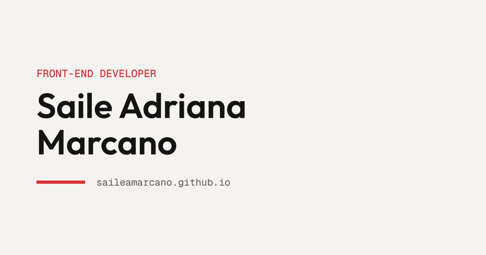

# Portfolio

My personal portfolio, built from scratch with HTML, CSS and vanilla JavaScript.

**Live site:** https://saileamarcano.github.io/portfolio/



## About

A single-page portfolio for a junior front-end developer. The design mixes a
clean component system with small game-inspired details: project cards styled
as inventory slots, monospace micro-labels, status tags, and buttons that press
down like physical keys.

It includes a **Now** section that lists what I'm currently learning and
building, so the site shows progress instead of a frozen snapshot.

## Built with

- Semantic HTML5
- CSS with custom properties, Grid and Flexbox
- Vanilla JavaScript (no frameworks, no build step)
- Mobile-first, responsive from 320px up

## Features

- Project cards rendered from a JavaScript data array — adding a project means
  editing one object, not duplicating markup
- Accessible mobile menu: keyboard support, `aria-expanded` state, closes on
  Escape and returns focus to the toggle
- Skip link, visible focus rings, and screen-reader-only labels
- Open Graph tags for link previews

## Structure
```
portfolio/
├── index.html
├── css/
│ └── style.css
├── js/
│ ├── data.js # project data
│ └── app.js # rendering and interactions
└── assets/
├── img/
└── fonts/
```

## Running it locally

```bash
git clone https://github.com/SaileAMarcano/portfolio.git
cd portfolio
```

No build step required. Open `index.html` in a browser, or use a local server
such as the Live Server extension for VS Code.

## Author

**Saile Adriana Marcano** — Front-end developer

- Site: https://saileamarcano.github.io/portfolio/
- GitHub: [@SaileAMarcano](https://github.com/SaileAMarcano)